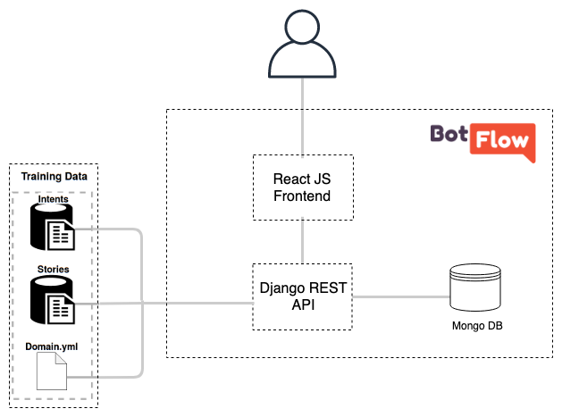

# BotFlow - visual content manager for simple [Rasa](https://blog.rasa.com/) chatbots

## How to use BotFlow
Instructions available on the [BotFlow website](https://lappis-unb.github.io/BotFlow/)

## Architecture

BotFlow is developed using React JS and Redux for the frontend layer. The backend is developed with Django REST, in the [BotFlow API repository](https://github.com/lappis-unb/botFlowAPI).

The frontend is divided in Pages, Components and Ducks:
* **Ducks** - The ducks folder contains the actions and reducers for Intents, Uttters and Stories. It configures the store and have all the functions needed for data manipulation and API connection.
* **Components** - The application pages are componentized, and this folder contain all its separate compontents.
* **Pages** - Contain the website pages.

In [Tais architecture](https://lappis-unb.github.io/tais/documentacao/arquitetura/), this platform generates the training data.



## Running the application
 
To run application properly you'll have to run the API as well. To do so, clone the [API repository](https://github.com/lappis-unb/botFlowAPI) and run `docker-compose up`.

Make sure the frontend is linked correctly with your API endpoint by checking the `REACT_APP_URL_API` env variable in the `docker-compose.yml` file on the frontend repository. If you API is running on another server just place the correct DNS or IP address.

After all API configuration is done, to run the application just run the `docker-compose up` command.


## Run the tests

* To run the tests use the command on the app/ folder:

    ``` sh
    npm test
    ```

* To run the tests and see the final coverage run:

    ``` sh
    npm test -- --coverage --watchAll=false
    ```

## About the project
BotFlow was originally created by [LAPPIS](https://lappis.rocks) as part of a project done in partnership with the Brazilian Ministry of Citizenship to manage the content of [Tais](https://github.com/lappis-unb/tais), a chatbot for the [culture incentive law](http://leideincentivoacultura.cultura.gov.br/).

**Want to develop a chatbot using the RASA Framework?? ✏️** [Access Rasa Boiler Plate PTBR](https://github.com/lappis-unb/rasa-ptbr-boilerplate)

## License
The entire BotFlow platform is developed under the license [GPL3](https://github.com/lappis-unb/BotFlow/blob/master/LICENSE)

View all the license dependencies [here](https://libraries.io/github/lappis-unb/BotFlow).
