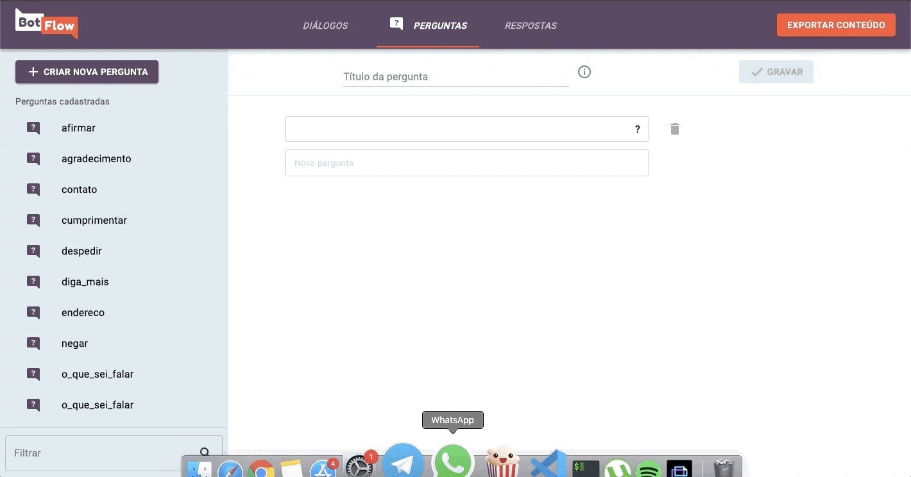
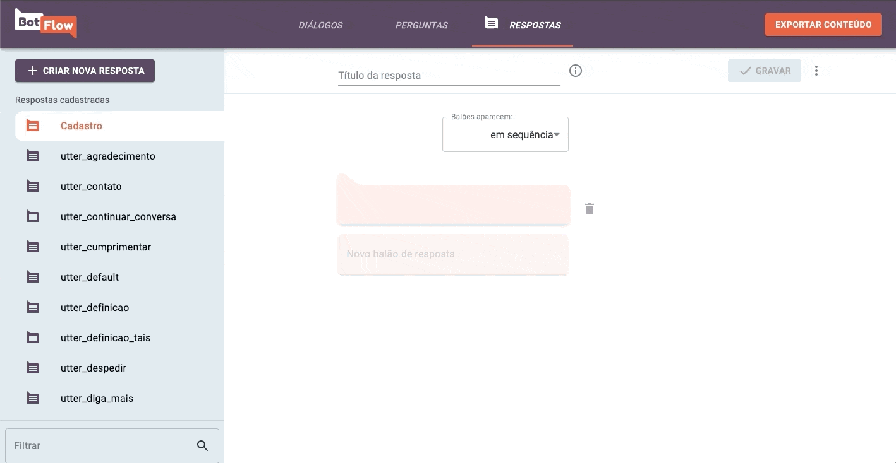

## How does it work?
Botflow allows you to add and edit intents, utters and stories without handling markdown or yaml files. 

### Intents
To add the intents, just go to the Questions page and add examples of user's inputs to that intent. You can also edit or delete a intent by selecting it on the sidebar.

### Utters
To add utters, just go to the Answers page and add your bot's answer. You can edit or delete a existing utter as well, just select it on the sidebar. The utters may be displayed as sequence or chosed between alternatives.

### Stories
A Story is a sequence of intents and utters. To create one, go to Dialogs page and select an existing story or create a new one. You can drag the elements to place it in the correct order. See an example of conversation on the right side of the screen.

### Save Content

After all content is ready, click on the Export Content button on the Navbar and it will download the created content.

## About the project
BotFlow was originally created by [LAPPIS](https://lappis.rocks) as part of a project done in partnership with the Brazilian Ministry of Citizenship to manage the content of [Tais](https://github.com/lappis-unb/tais), a chatbot for the [culture incentive law](http://leideincentivoacultura.cultura.gov.br/).

## License
The entire BotFlow platform is developed under the license [GPL3](https://github.com/lappis-unb/BotFlow/blob/master/LICENSE)